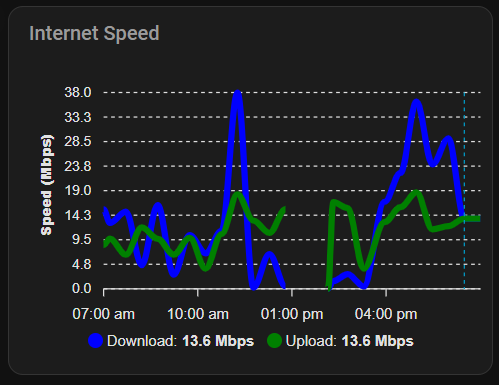
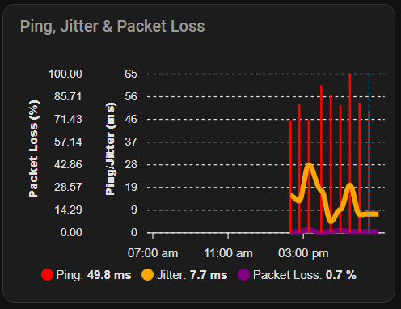
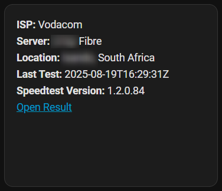

## NOTE: If you installed apexcharts-card from HACS, this should be a copy/paste for get you going.

### Internet Speed card

``` yaml
type: custom:apexcharts-card
header:
  title: Internet Speed
  show: true
graph_span: 12h
span:
  end: hour
now:
  show: true
yaxis:
  - id: speed
    decimals: 1
    min: 0
    apex_config:
      title:
        text: Speed (Mbps)
series:
  - entity: sensor.speedtest_download
    name: Download
    type: line
    color: blue
    yaxis_id: speed
  - entity: sensor.speedtest_upload
    name: Upload
    type: line
    color: green
    yaxis_id: speed
```

### Ping, Jitter & Packet Loss

``` yaml
type: custom:apexcharts-card
header:
  title: Ping, Jitter & Packet Loss
  show: true
graph_span: 12h
span:
  end: hour
now:
  show: true
yaxis:
  - id: ping
    decimals: 0
    min: 0
    apex_config:
      title:
        text: Ping/Jitter (ms)
  - id: loss
    decimals: 2
    min: 0
    max: 100
    apex_config:
      title:
        text: Packet Loss (%)
series:
  - entity: sensor.speedtest_ping_latency
    name: Ping
    type: column
    color: red
    yaxis_id: ping
  - entity: sensor.speedtest_ping_jitter
    name: Jitter
    type: line
    color: orange
    yaxis_id: ping
  - entity: sensor.speedtest_packet_loss
    name: Packet Loss
    type: area
    color: purple
    yaxis_id: loss
```

## This is a standard markdown card

``` markdown
**ISP:** {{ states('sensor.speedtest_isp') }}
**Server:** {{ states('sensor.speedtest_server') }}
**Location:** {{ states('sensor.speedtest_server_location') }}, {{ states('sensor.speedtest_server_country') }}
**Last Test:** {{ states('sensor.speedtest_timestamp') }}
**Speedtest Version:** {{ states('sensor.speedtest_version') }}
[Open Result]({{ states('sensor.speedtest_result_url') }})
```